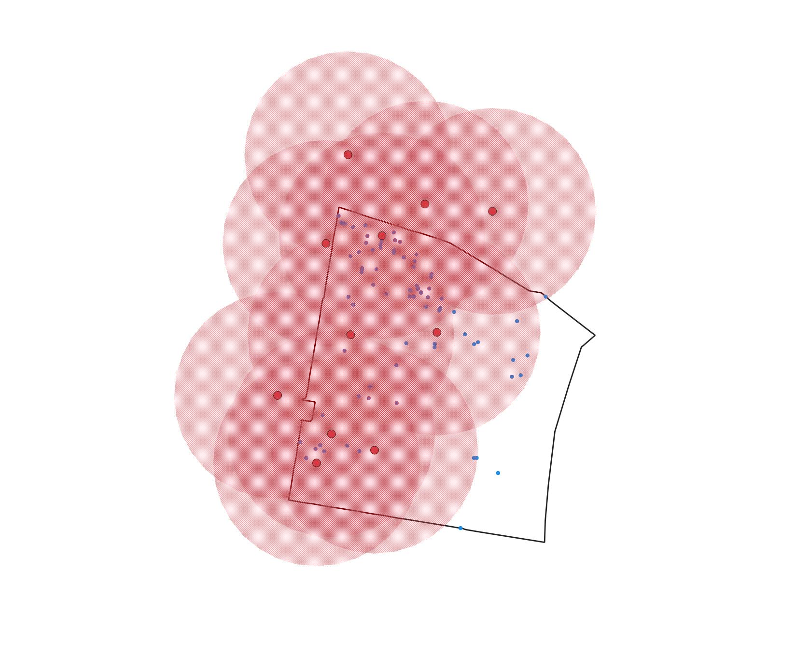
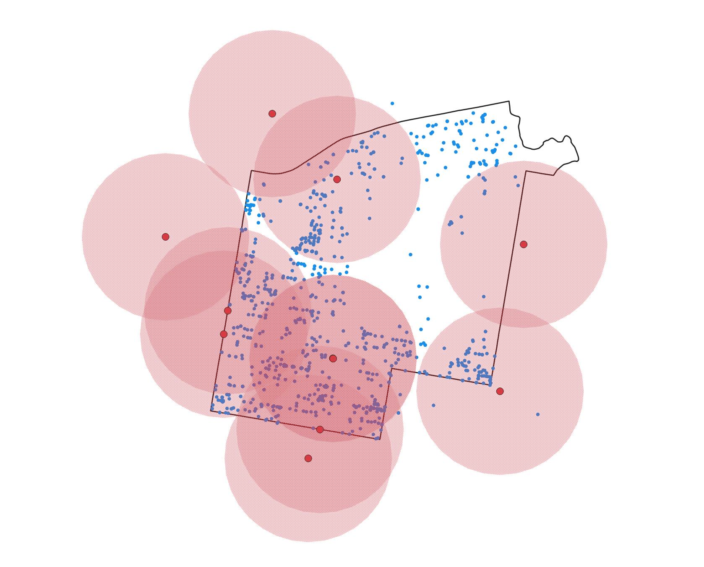
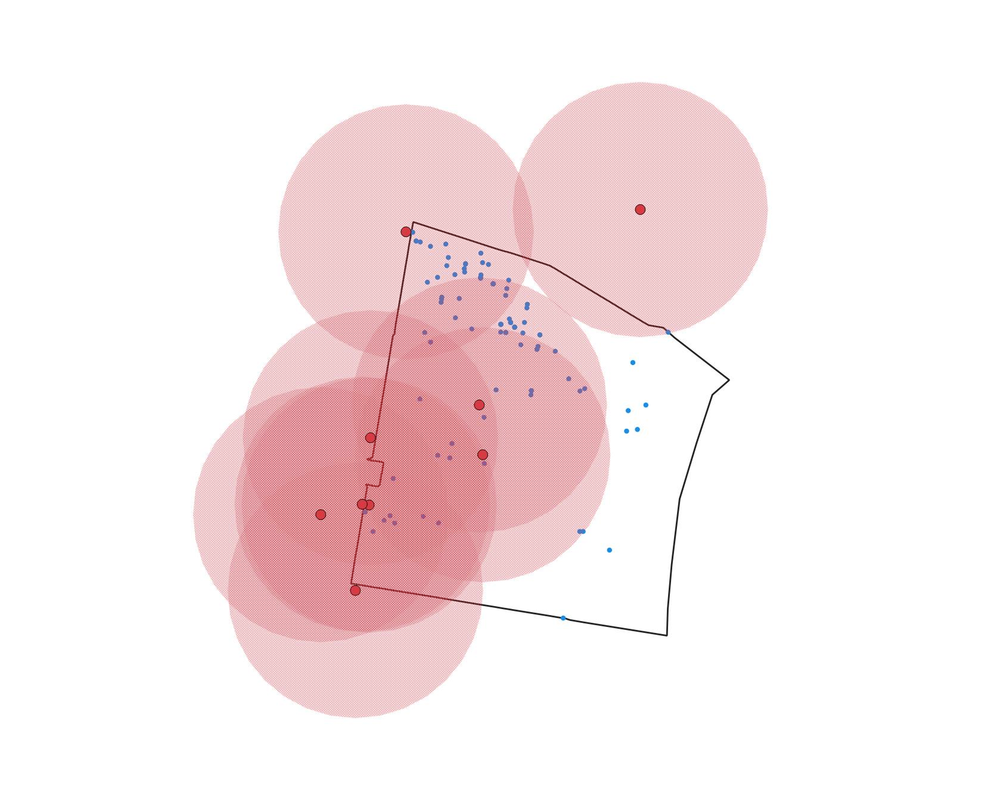
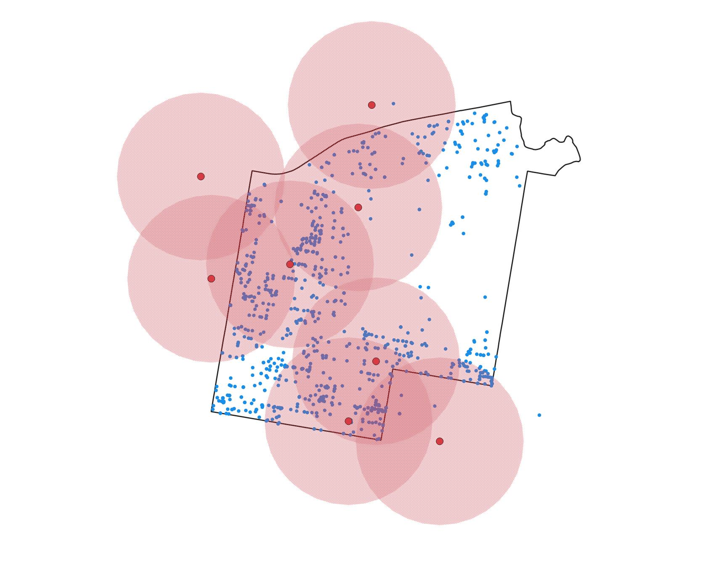

### Term Project
Ariel Akins

## Gun Violence in Philadelphia

Philadelphia has seen an increase in gun violence over the last few years, which has created one of the highest homicide rates among large cities in the nation. 86% of reported homicides in Philadelphia involve a firearm, and the homicide mortality rate (per 100,000 people) has increased from 15.5 in 2013 to 20.8 in 2019 [Health Of The City](https://www.phila.gov/media/20201230141933/HealthOfTheCity-2020.pdf), which has only continued to increase through 2021.

Gun violence is among other health and safety issues that Philadelphia is facing, including chronic health conditions and an opiod epidemic. Many of these issues have common factors; what type of access do residents across Philadelphia have that could prevent harm to its citizens? This could be in terms of physical or mental health.

In this analysis, we will look at shooting incidents across Philadelphia over the last few years to find whether there is a connection between gun violence and access to resources such as housing counseling services, social service centers, health centers, neighborhood advisory committees, and neighborhood energy centers. If residents have access to services that could lower stress and improve mental health, would Philadelphia see less gun violence?


### Shooting Victims Dataset

The data that we will be exploring is the Shooting Victims dataset provided by the Statistics Unit of the Philadelphia Police Department. This contains any shooting incident that has occurred since January 1, 2015, and is updated every weekday. This dataset includes the location of the shooting (lat, long, address, and whether it is inside or outside), date and time, information about the victim such as sex, race, wound, and age, involvement with a police officer, any injury or death of the shooter, police district and police code, and whether or not the incident was fatal. The coordinate system for this data is in WGS84.

There are a few other tables that this data will be used against, including health centers and neighborhood resources. Both of these tables are used to store the location, name, contact information, and services of the centers. The Health Centers dataset is maintained by the Philadelphia Department of Public Health, and the Neighborhood Resources dataset is maintained by the Philadelphia Department of Planning and Development. 

With this data, we can start to see the connection between available resources for Philadelphians, and gun violence. We know that gun violence can result from a multitude of issues, but across the country we know that many incidents of violence can result from an inaccessibility to mental health services. In Philadelphia, what police districts have the most & least shooting incidents, and are they in areas that residents do not have many resources that could help ease stress and improve mental health? 

### Normalization

For the purpose of this analysis, we do not need all of the columns provided in the Shooting Incident table, and many values in the rows are similar but not exact, as they are all manually inputted. Before we start using the data, we are going to normalize all of the tables, including the health center and neighborhood resource tables. 

From the main data collection of shooting incidents, to normalize the data we will create 6 separate tables from Shooting Victims. These will be the Incident and Victim tables, along with lookup tables of Race, Sex, Wound, and Inside/Outside.

The Incident table will include columns; *gid, geom, date, in_out_code, ppdcode, district, officer_inv, offender_inj,* and *offender_d*. The *gid* is a serial data type, which was created when the dataset was imported in QGIS. The *gid* is the primary key for the Incident table, as every incident will have a different gid. The geometry was also created upon import from QGIS, and both *gid* and *geom* will remain in their original data types. In the original Shooting Victims table, there were three columns related to dates; the year, the date, and the time. We will not need the time for our analysis, and the year can be indicated from the date, we will only add the *date* column to our Incident table, in the date data type. The Incident table will also contain the police code and police district, which are both originally in a varchar data type but will both be numeric columns in Incident; *ppdcode, district*. In the original table, there were two separate numeric columns 'inside' and 'outside' to show where the incident occurred; 0 represented no and 1 represented yes, and there were zero rows that could be both 0 or both 1. From these two columns, I created a lookup table In_Out with two columns for the code and description; 0 for all outside incidents and 1 for all inside incidents. The *in_out_code* representing the location will be referenced in Incident as a foreign key. There are also three varchar columns in the Shooting Victims table for officer involvement, if the offender was injured, and if the offender died; all three are coded to use 0 as 'false' and 1 as 'true'. In the Incident table, we will add all three columns and save them as a boolean data type; *officer_inv, offender_inj, offender_d*.

The next table we will pull from the original data is the Victim table, made up of *victimid, gid, race_code, sex_code, fatal, wound_code, age,* and *latino*. As the original data does not identify victims, we will add a serial data type column for the *victimid*, which is the primary key of the Victim table. We will also add *gid* from Incident as a foreign key, to reference the incident relating to the victim. The sex, race, and wound of the victims will all use numeric values that are created and referenced in the lookup tables Sex, Race, and Wound, all of which will be foreign keys in Victim. The Sex table will assign a 0 numeric value to represent all Male victims, and a 1 for all Female victims. The Race table will be set up in the same way; numeric values 0-4 representing the race of the victim that is stored in Shooting Victims; 'Black,' 'White,', 'Asian,' 'American Indian,' and 'Unknown/Other.' The third lookup table referenced as a foreign key is Wound. Since the data is manually input, there are over a hundred different values for the wound of the victim. For our analysis, we will simplify these values to 6 different wounds; 0-5 numeric values representing 'Chest/Torso,' 'Head,' 'Leg,' 'Arm,' 'Back,' and 'Multiple.' In the Shooting Victims table, there are two numeric columns (0 representing 'false,' 1 'true') for victim fatalities and latino victims. These will both be added into Victim as a boolean columns, similar to the officer involement and offender injury columns we created in Incident. The last column that will be in the Victim table is the age of the victim, which are all numeric values.


Other datasets, like Health Centers and Neighborhood Resources, will be tables that are created to store only the geometry and name of the centers. We will also briefly take a look at the geometry of police district boundaries, imported as police_dist and containing only the polygon geometry and name of each police district.

### Optimization

There have been a recorded 9,197 shooting incidents reported since 2015. As we will be performing spatial joins on each point in the *incident, resources,* and *health_centers* tables, we will create an index of the geometries in each, to allow queries to process faster.

```
create index incident_ind 
on incident
using gist(geom);

create index resource_in
on resources
using gist(geom);

create index health_ind
on health_centers
using gist(geom);
```

### Analysis

To see the connection between available resources and incidents, let's first take a look at how many incidents and resources there are by police district. Let's start by doing a count of all shooting incidents by each district. Here we are using count(*) to return the number of shooting incidents, and we are also selecting the district column to show how many are in which district. We use a group by statement to group the number of incidents by district, and use an order by statement to order the results from lowest to highest.

```
select count(*), district
from incident i 
group by district
order by count(*);
```

We can see that the districts that have the least amount of shootings (100 and under since 2015) are districts 5 through 9, which are areas located in Center City, far Northeast, and Roxborough/Manayunk. The most incidents (900 to 1150) are seen in districts 22, 24, and 25, which are located in North Philadelphia and Kensington. 

Now let's do a count of resources by district. This example will briefly use two tables that will only be used for this reference, which are the polygon geometries of police districts, and a combined table of *health_centers* and *resources* that I have called totalresources. Both are not needed for final queries but are available on OpenDataPhilly if interested. Same as before, we are using count(*) to collect the number of resources within each police district. We use a spatial join of resource point geometries, with the police_dist polygon geometries, to count how many resources fall within each polygon. Using a group by statement we will group all resources by police district, and order from the lowest count to highest.

```
select count(*), district
from totalresources r
join police_dist pd 
on st_intersects(r.geom, pd.geom)
group by district
order by count(*);
```
The districts that contain only one neighborhood resource are districts 1 (Southwest Philadelphia), 2 (Northeast), and 5 (Center City), and the districts that have as many as 9 resources are 6 (Center City East), 14 (Germantown/Chestnut Hill), and 25 (North Philadelphia).

We know that resources will not be evenly dispersed around the city, so for our analysis we will focus on a district with very low shooting incidents and very high shooting incidents; District 6 (Center City East) and District 25 (North Philadelphia, east of Broad St. where Temple Medical Campus is located). For reference, District 6 is approximately 2.5 square miles, and District 25 is almost double the size, approximately 4.25 square miles.

Our goal for this query is to find how many resources are available within 1000m of each shooting incident. This query uses count(*) to return the number of health centers, and i.* will return all of the columns from the *incident* table. We are using a spatial join to the *incident* table by using ST_Intersects. Our first argument will be the geomertry of each health center, which are point geometries. For our second argument, we will then use ST_Buffer to create 1000m buffers from each incident geometry. ST_Intersects will return any geometries that intersect both of the arguments. By using a where statement we limit our search to all incidents that occurred in District 6, and the group by clause will keep each shooting incident separate. We will also use order by to arrange the return from the highest amount of health centers nearby, to the lowest. 

**District 6**
```
select count(*), i.*
from health_centers hc 
join incident i
on st_intersects(hc.geom, st_buffer(i.geom, 1000))
where i.district = 6
group by i.gid
order by count(*) desc;
```


From our first query of incidents by district, we know that there were 101 shootings from 2015 to present day. The above query returns 98 rows, which means almost every shooting incident occurred within 1000m of a health center resource. Of those 98 incidents, 80% of them were within 4 to 6 health centers, and only 12% of incidents were only within 1 available health center. This means there is a wide range of available help to residents of Center City East. Let's now try the same query, but change our where clause to return only incidents that occurred in District 25. 

**District 25**
```
select count(*), i.*
from health_centers hc 
join incident i
on st_intersects(hc.geom, st_buffer(i.geom, 1000))
where i.district = 25
group by i.gid
order by count(*) desc;
```


Compared to the number of shooting incidents in District 25 (1,145), 977 incidents were within 1000m of a health center. This means that 15% of all incidents from District 25 were in areas that there are 0 available health centers, compared to the 3% of shootings in Center City that were not near any available resources. Of these 977 incidents, only 24% of them were within areas that had 4 or 5 nearby health centers. 34% of the incidents had only one health center within a 1000m distance. 

Besides health centers, there are other resources that could help alleviate stress and improve mental health. These are in our *resources* table, which include Housing Counseling Agencies, Neighborhood Advisory Committees, and Neighborhood Energy Centers. These are centers that assist in housing, bill payments, and neighborhood engagement. 

We will use the same style of query to find the amount of Neighborhood Resources within Districts 6 and 25. 
We will select the count of all resources, and return all columns from the *incident* table. We will use a spatial join to the *incident* table, by using ST_Intersects. Our arguments for ST_Intersects will be the *resources* point geometry, and a 1000m buffer of each *incident* point geometry. Using a where statement we will limit our search to District 6 from the *incident* table, group by each shooting incident, and order from highest count to lowest.

**District 6**
```
select count(*), i.*
from resources r 
join incident i
on st_intersects(r.geom, st_buffer(i.geom, 1000))
where i.district = 6
group by i.gid
order by count(*) desc;
```



The result show us that 93 incidents were within 1000m of a neighborhood resource, 15% of which are within 4 to 7 resources. 48% of incidents are located near only one resource that offers assistance. 

For District 25, the select, spatial join, group by, and order by statements will all be the same as above, and the only change will be the where statement to select District 25 from the incident table. 

**District 25**
```
select count(*), i.*
from resources r 
join incident i
on st_intersects(r.geom, st_buffer(i.geom, 1000))
where i.district = 25
group by i.gid
order by count(*) desc;
```



The result shows a total of 912, 80% of all District 25 shooting incidents, an even lower number than the health center query we completed. Of these 912 incidents, 100% of them are located within 3 or less neighborhood resources; 29% are located within 1000m of only 1 of the assistance centers.

We know that there are additional factors that could increase the gun violence that we have seen across Philadelphia such as the added financial, physical, and mental stress caused by COVID-19 and the opiod epidemic, but from this analysis we can see that available health & wellness resources could potentially change the amount of people affected by gun violence by lowering the mental and financial stress on Philadelphians. 


#### Appendix A
#### Accessing the Data

All datasets can be accessed at https://www.opendataphilly.org/.

In the search bar, search and download shapefiles for "Neighborhood Resources," "Health Centers," "Shooting Victims," and "Police Districts."

First in DBeaver we will create a new schema that will hold all of our tables, which we will call 'crime'. Open QGIS and select 'DBManager' from the top row of tabs, and then 'POSTGis' on the left side, and connect to your database. By selecting 'Import Layer/File', we can add all of the above shapefiles to the 'crime' schema by selecting 'input' and then selecting the .shp of each file. Change the primary key from 'id' to 'gid', and change the target SRID from WGS84 to EPSG:26918. Click the box to convert all fields to lowercase, and to create spatial index. Now when you refresh your 'crime' schema in DBeaver, you should see all of your new tables!

#### Appendix B
#### Normalization 

To normalize our data to be used, we will complete what was explained above in **Normalization**
```
DROP TABLE IF EXISTS in_out CASCADE;
CREATE TABLE in_out (
	in_out_code int primary key,
	in_out varchar 
   );
  
insert into in_out(in_out_code, in_out)
values 
	(0, 'Outside'),
	(1, 'Inside');

DROP TABLE IF EXISTS race CASCADE;
CREATE TABLE race (
	race_code int primary key,
	race varchar,
	description varchar
   );

 insert into race(race_code, race, description)
 values 
 	(0, 'W', 'White'),
 	(1, 'B', 'Black'),
 	(2, 'A', 'Asian'),
 	(3, 'I', 'American Indian'),
 	(4, 'U', 'Unknown/Other');

DROP TABLE IF EXISTS sex CASCADE;
CREATE TABLE sex (
	sex_code int primary key,
	sex varchar 
   );
  
insert into sex(sex_code, sex)
values 
	(0, 'M'),
	(1, 'F');

DROP TABLE IF EXISTS wound CASCADE;
CREATE TABLE wound (
	wound_code int primary key,
	wound varchar 
   );
  
insert into wound 
values 
	(0, 'Chest/Torso'),
	(1, 'Head'),
	(2, 'Leg'),
	(3, 'Arm'),
	(4, 'Back'),
	(5, 'Multiple');

update shootings1 
set wound = 'Head'
where wound in ('HEAD', 'NECK', 'NOSE', 'Neck', 'cheek', 'ear', 'eye', 'face', 'head', 'neck', 'temple', 'throat', 'head-m','head-md','head/neck');

update shootings1 
set wound = 'Chest/Torso'
where wound in ('aabdomen', 'abdom', 'abdome', 'abdomen', 'Abdomen', 'ABDOMEN', 'ribs', 'side', 'stom', 'stomach', 'Stomach', 'STOMACH', 'torso',
'cheat','chect','chest','Chest','CHEST', 'body', 'flank');

update shootings1 
set wound = 'Leg'
where wound in ('ankle','Ankle','ankles','calf','feet','foot','Foot','FOOT','groin','Groin','hip','Hip','knee',
'knees','leg','Leg','LEG','legs','pelvis','Pelvis','shin','testicle','thigh','THIGH','thighs','toe','waist','leg/buttoc');

update shootings1 
set wound = 'Arm'
where wound in ('arm','Arm','ARM','armpit','arms','elbow','finger','fingers','forearm','hand','Hand','HAND','shou','shoul','should','shouldeer','shoulder',
'Shoulder','SHOULDER','shoulders','shouldr','thumb','wrist','Wrist');

update shootings1 
set wound = 'Back'
where wound in ('back','Back','BACK','butt','buttock','buttocks','Buttocks');

update shootings1 
set wound = 'Multiple'
where wound in (
'back/head','chest/back','face/multi','head/back','head/chest','head/mullt','head/multi','leg/multi','mukti','mullti','mult','mult/headi',
'multi','Multi','MULTI','multi leg','multi tors','multi/ hea','multi/arm','multi/face','multi/head','multii','Multiple','Multiple/Hea',
'multli','mutli','mutli/head','unk','Unknown');

DROP TABLE IF EXISTS incident CASCADE;
CREATE TABLE incident (
	gid serial primary key,
	geom geometry(point, 26918), 
	date date,
	in_out_code int references in_out(in_out_code), 
    ppdcode int,
    district int, 
    officer_inv bool,
    offender_inj bool,
    offender_d bool 
   );
  
insert into incident(gid, geom, date, in_out_code, ppdcode, district, officer_inv, offender_inj, offender_d)
select 
	gid,
	geom, 
	date_,
	(select in_out_code from in_out b where b.in_out_code = a.inside),
	code::int,
	dist::int,
	(case when officer_in='Y' then true else false end),
	(case when offender_i='Y' then true else false end),
	(case when offender_d='Y' then true else false end)
from shootings1 a;

DROP TABLE IF EXISTS victim CASCADE;
CREATE TABLE victim (
	victimid serial primary key,
	gid int references incident(gid),
	race_code int references race(race_code),
	sex_code int references sex(sex_code), 
	fatal bool,
	wound_code int references wound(wound_code),
	age int, 
	latino bool
   );
  
  insert into victim(gid, race_code, sex_code, fatal, wound_code, age, latino)
  select 
  	gid,  
  	(select race_code from race r where r.race = s.race),
  	(select sex_code from sex a where a.sex = s.sex),
  	(case when fatal=1 then true else false end),
	(select wound_code from wound w where w.wound = s.wound),
  	age::int, 
  	(case when latino=1 then true else false end)
  from shootings1 s; 
 

DROP TABLE IF EXISTS health_centers CASCADE;
CREATE TABLE health_centers (
	gid serial primary key,
	geom geometry (point, 26918),
	name varchar
   );
  
insert into health_centers
select gid, 
	geom, 
	name
from healthcenters;

DROP TABLE IF EXISTS resources CASCADE;
CREATE TABLE resources (
	gid serial primary key,
	geom geometry (point, 26918),
	name varchar
   );
  
insert into resources
select gid, 
	geom, 
	agency
from "NeighborhoodResources";

DROP TABLE IF EXISTS police_dist CASCADE;
CREATE TABLE police_dist (
	gid serial primary key,
	geom geometry (multipolygon, 26918),
	district int
   );
  
insert into police_dist
select gid, 
	geom, 
	dist_num
from "Boundaries_District";
```

#### Appendix C
#### Indexes

```
create index incident_ind 
on incident
using gist(geom);

create index resource_in
on resources
using gist(geom);

create index health_ind
on health_centers
using gist(geom);
```

#### Appendix D
#### Data Dictionary

**Incident**
*gid*           serial              primary key;incrementing number, different for each row representing a different shooting incident
*geom*          geom(point,26918)   point geometry of all shooting incidents, in SRID 26918
*date*          date                year, month, and day of each incident
*in_out_code*   integer             foreign key from the in_out table
*ppdcode*       integer             police code for crime taking place
*district*      integer             Philadelphia Police District
*officer_inv*   boolean             true/false; police officer involved in shooting
*offender_inj*  boolean             true/false; offender injured
*offender_d*    boolean             true/false; death of offender

**Victim** 
*victimid*      serial              primary key; incrementing number, representing each victim 
*gid*           integer             foreign key of serial numbers from Incident table
*race_code*     integer             foreign key from race table- 0-4
*sex_code*      integer             foreign key from sex table- 0 or 1
*fatal*         boolean             true/false; whether the victim died
*wound_code*    integer             foreign key from wound table- 0-5
*age*           integer             age of shooting victim
*latino*        boolen              true/false; whether victim is latinx

**in_out**
*in_out_code*   integer             primary key; 0 or 1 relating to in_out value
*in_out*        varchar             Outside(0) or Inside (1)

**race**
*race_code*     integer             primary key; 0-4 relating to 'race' value
*race*          varchar             race of victim from original Shooting Victim table; 'W' 'B' 'A' 'I' 'U'
*description*   varchar             race of victim; 'White' 'Black' 'Asian' 'American Indian' 'Unknown/Other'

**sex_code**
*sex_code*      integer             primary key; 0 or 1 relating to 'sex' value
*sex*           varchar             M (0, Male) or F (1, Female) 

**wound_code**
*wound_code*    integer             primary key; 0-5 value relating to wound value
*wound*         varchar             victim injury area; Chest/Torso, Head, Leg, Arm, Back, Multiple

**health_centers**
*gid*           serial              primary key; incrementing value for each new health center location
*geom*          geom(point,26918)   point geometry of all health centers, in SRID 26918
*name*          varchar             name of health center

**resources**
*gid*           serial              primary key; incrementing value for each neighborhood resource location
*geom*          geom(point,26918)   point geometry of all resource centers, in SRID 26918
*name*          varchar             name of facility

**police_dist**
*gid*           serial              primary key; incrementing value for each police district
*geom*          geom(multipolygon,  polygon geometry
                26918)
*district*      integer             Philadelphia Police District