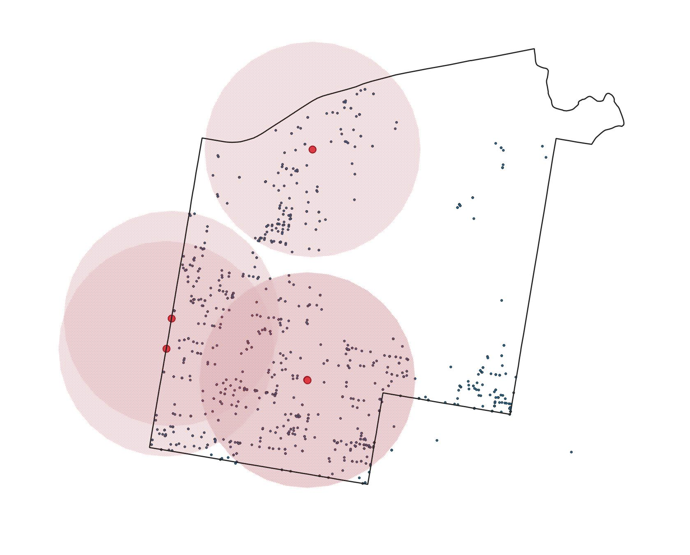

### Term Project
Ariel Akins

## Gun Violence in Philadelphia

Philadelphia has seen an increase in gun violence over the last few years, which has created one of the highest homicide rates among large cities in the nation. 86% of reported homicides in Philadelphia involve a firearm, and the homicide mortality rate (per 100,000 people) has increased from 15.5 in 2013 to 20.8 in 2019 (https://www.phila.gov/media/20201230141933/HealthOfTheCity-2020.pdf), which has only continued to increase through 2021.

Gun violence is among other health and safety issues that Philadelphia is facing, including chronic health conditions and the opiod epidemic. Many of these issues have common factors; what type of access do residents across Philadelphia have that could prevent harm to its citizens? This could be in terms of physical or mental health.

In this analysis, we will look at shooting incidents across Philadelphia over the last few years to find whether there is a connection between gun violence and access to resources such as housing counceling services, social service centers, health centers, neighborhood advisory committees, and neighborhood energy centers. If residents have access to services that could lower stress and improve mental health, would Philadelphia see less gun violence?


### Shooting Victims Dataset

The data that we will be exploring is the Shooting Victims dataset provided by the Statistics Unit of the Philadelphia Police Department. This contains any shooting incident that has occurred since January 1, 2015, and is updated every weekday. This dataset includes the location of the shooting (lat, long, address, and whether it is inside or outside), date and time, information about the victim such as sex, race, wound, and age, involvement with a police officer, any injury or death of the shooter, police district and police code, and whether or not the incident was fatal. The coordinate system for this data is in WGS84.

There are a few other tables that this data will be used against, including health centers and neighborhood resources. Both of these tables are used to store the location, name, contact information, and services of the centers. The Health Centers dataset is maintained by the Philadelphia Department of Public Health, and the Neighborhood Resources dataset is maintained by the Philadelphia Department of Planning and Development. 

With this data, we can start to see the connection between available resources for Philadelphians, and gun violence. We know that gun violence can result from a multitude of issues, but across the country we know that many incidents of violence can result from a inaccessibility to mental health resources. In Philadelphia, what police districts have the most & least shooting incidents, and are they in areas that residents do not have many resources that could help ease stress and improve mental health? 

### Normalization

For the purpose of this analysis, we do not need all of the columns provided in the Shooting Incident table, and many values in the rows are similar but not exact, as they are all manually inputted. Before we start using the data, we are going to normalize all of the tables, including the health center and neighborhood resource tables. 

From the main data collection of shooting incidents, to normalize the data we will create 6 separate tables from Shooting Victims. These will be the Incident and Victim tables, along with lookup tables of Race, Sex, Wound, and Inside/Outside.

The Incident table will include columns; gid, geom, date, in_out_code, ppdcode, district, officer_inv, offender_inj, and offender_d. The gid is a serial data type, which was created when the dataset was imported in QGIS. The gid is the primary key for the Incident table, as every incident will have a different gid. The geometry was also created upon import from QGIS, and both gid and geom will remain in their original data types. In the original Shooting Victims table, there were three columns related to dates; the year, the date, and the time. We will not need the time for our analysis, and the year can be indicated from the date, we will only add the date column to our Incident table, in the date data type. The Incident table will also contain the police code and police district, which are both originally in a varchar data type but will both be numeric columns in Incident. In the original table, there were two separate numeric columns 'inside' and 'outside' to show where the incident occurred; 0 represented no and 1 represented yes, and there were no rows that could be both 0 or both be 1. From these two columns, I created a lookup table In_Out with two columns for the code and description; 0 for all outside incidents and 1 for all inside incidents. The in_out_code representing the location will be referenced in Incident as a foreign key. There are also three varchar columns in the Shooting Victims table for officer involvement, if the offender was injured, and if the offender died; all three are coded to use 0 as 'false' and 1 as 'true'. In the Incident table, we will add all three columns and save them as a boolean data type.

The next table we will pull from the original data is the Victim table. As the original data does not identify victims, we will add a serial data type column for the victimid, which is the primary key of the Victim table. We will also add gid from Incident as a foreign key, to reference the incident relating to the victim. The sex, race, and wounds of the victims will all use numeric values that are created and referenced in the lookup tables Sex, Race, and Wound, all of which will be foreign keys in Victim. The Sex table will assign a 0 numeric value to represent all Male victims, and a 1 for all Female victims. The Race table will be set up in the same way; numeric values 0-4 representing the race of the victim that is stored in Shooting Victims; 'Black,' 'White,', 'Asian,' 'American Indian,' and 'Unknown/Other.' The third lookup table referenced as a foreign key is Wound. Since the data is manually input, there are over a hundred different values for the wound of the victim. For our analysis, we will simplify these values to 6 different wounds; 0-5 numeric values representing 'Chest/Torso,' 'Head,' 'Leg,' 'Arm,' 'Back,' and 'Multiple.' In the Shooting Victims table, there are two numeric columns (0 representing 'false,' 1 'true') for victim fatalities and latino victims. These will both be added into Victim as a boolean columns, similar to the officer involement and offender injury columns we created in Incident. The last column that will be in the Victim table is the age of the victim, which are all numeric values.

Other datasets, like Health Centers and Neighborhood Resources, will be tables that are created to store only the geometry and name of the centers. We will also briefly take a look at the geometry of police district boundaries, imported as police_dist and containing only the geometry and name of each police district.

### Optimization

There have been a recorded 9,197 shooting incidents reported since 2015. As we will be performing spatial joins on each point in the *incident, resources,* and *health_centers* tables, we will create an index of the geometries in each, to allow queries to process faster.

```
create index incident_ind 
on incident
using gist(geom);

create index resource_in
on resources
using gist(geom);

create index health_ind
on health_centers
using gist(geom);
```

### Analysis

To see the connection between available resources and incidents, lets first take a look at how many incidents and resources there are by police district. Let's start by doing a count of all shooting incidents by each district;
```
select count(*), district
from incident i 
group by district
order by count(*);
```
We can see that the districts that have the least amount of shootings (100 and under since 2015) are districts 5 through 9, which are areas located in Center City, far Northeast, and Roxborough/Manayunk. The most incidents (900 to 1150) are seen in districts 22, 24, and 25, which are located in North Philadelphia and Kensington. Now let's do a count of resources by district;
```
select count(*), district
from resources r 
join police_dist pd 
on st_intersects(r.geom, pd.geom)
group by district
order by count(*);
```
The districts that contain only one neighborhood resource are districts 1 (Southwest Philadelphia), 2 (Northeast), and 5 (Center City), and the districts that have as many as 9 resources are 6 (Center City East), 14 (Germantown/Chestnut Hill), and 25 (North Philadelphia).

We know that resources will not be evenly dispersed around the city, so for our analysis we will focus on a district with very low shooting incidents and very high shooting incidents; District 6 (Center City East) and District 25 (North Philadelphia, east of Broad St. where Temple Medical Campus is located). For reference, District 6 is approximately 2.5 square miles, and District 25 is almost double the size, approximately 4.25 square miles.

Our goal for this query is to find how many resources are available within 1000m of each shooting incident. This query uses count(*) to return the number of health centers, and i.* will return all of the columns from the Incident table. We are using ST_Intersects to perform a spatial join of the health center geometry, to find where any intersect with a 1000m buffer of each shooting incident. By using a where statement we limit our search to all incidents that occurred in District 6, and the group by clause will keep each shooting incident separate. We will also use order by to arrange the return from the highest amount of health centers nearby, to the lowest. 
```
select count(*), i.*
from health_centers hc 
join incident i
on st_intersects(hc.geom, st_buffer(i.geom, 1000))
where i.district = 6
group by i.gid
order by count(*) desc;
```
From our first query of incidents by district, we know that there were 101 shootings from 2015 to present day. The above query returns 98 rows, which means almost every shooting incident occurred within 1000m of a health center resource. Of those 98 incidents, 80% of them were within 4 to 6 health centers, and only 12% of incidents were only within 1 available health center. This means there is a wide range of available help to residents of Center City East. Let's now try the same query, but change our where clause to return only incidents that occurred in District 25. 
```
select count(*), i.*
from health_centers hc 
join incident i
on st_intersects(hc.geom, st_buffer(i.geom, 1000))
where i.district = 25
group by i.gid
order by count(*) desc;
```
Compared to the number of shooting incidents in District 25 (1,145), 977 incidents were within 1000m of a health center. This means that 15% of all incidents from District 25 were in areas that there are 0 available health centers, compared to the 3% of shootings in Center City that were not near any available resources. Of these 977 incidents, only 24% of them were within areas that had 4 or 5 nearby health centers. 34% of the incidents had only one health center within a 1000m distance. 



Now we will use a similar query to find the amount of Neighborhood Resources within a police district. 


Provide the 3 analytical queries that you developed for Milestone 4. Use only the final, optimized version of each query. For each query, begin by describing the question you are trying to answer, followed by the query itself, followed by a discussion of how the query works. The discussion of the query operation should assume the reader understands basic SQL but not spatial SQL. Explain any subqueries, CTEs, spatial functions or operators, and complex joins.

Describe the dataset generally, including its source and purpose. Describe some of the spatial questions you will use it to answer. If you combine your main dataset with other data for you analytical queries, describe those additional datasources, but more briefly.


Describe the structure of the data and your normalization process. Provide an ERD of the final schema.
